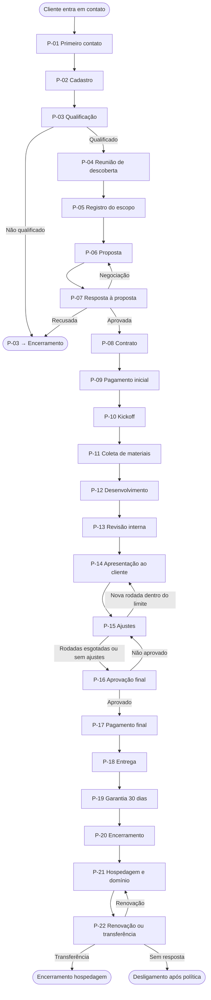

# Norax — Fluxograma Operacional

**Documento:** Processo Principal · Lead → Pós-venda  
**Versão:** 1.0  
**Escopo:** Sites Institucionais · Landing Pages · Sistemas Web  
**Operador atual:** Fundador (solo)  
**Status:** Documento de referência operacional

---

## Índice de processos

| ID | Etapa | Fase |
|----|-------|------|
| P-01 | Primeiro contato | Aquisição |
| P-02 | Cadastro | Aquisição |
| P-03 | Qualificação rápida | Aquisição |
| P-04 | Reunião de descoberta | Descoberta |
| P-05 | Registro do escopo | Descoberta |
| P-06 | Proposta | Descoberta |
| P-07 | Resposta à proposta | Descoberta |
| P-08 | Contrato | Fechamento |
| P-09 | Pagamento inicial | Fechamento |
| P-10 | Kickoff do projeto | Execução |
| P-11 | Coleta de materiais | Execução |
| P-12 | Desenvolvimento | Execução |
| P-13 | Revisão interna | Execução |
| P-14 | Apresentação ao cliente | Execução |
| P-15 | Ajustes | Execução |
| P-16 | Aprovação final | Execução |
| P-17 | Pagamento final | Execução |
| P-18 | Entrega | Pós-venda |
| P-19 | Garantia (30 dias) | Pós-venda |
| P-20 | Encerramento do projeto | Pós-venda |
| P-21 | Hospedagem e domínio | Pós-venda |
| P-22 | Renovação ou transferência | Pós-venda |

---

## Diagrama de alto nível

---

## Gates obrigatórios

Processos que **não podem ser ignorados** em nenhuma circunstância:

| Gate | Condição para avançar |
|------|------------------------|
| G-01 | Contrato assinado antes de qualquer desenvolvimento |
| G-02 | Pagamento inicial confirmado antes do kickoff |
| G-03 | Materiais completos antes de iniciar contagem de prazo |
| G-04 | Aprovação final por escrito antes da entrega definitiva |
| G-05 | Pagamento final confirmado antes da entrega (exceto 100% upfront) |
| G-06 | Registro de vencimento de hospedagem no dia da entrega |

---

# FASE 1 — AQUISIÇÃO

---

## P-01 · Primeiro contato

| Campo | Detalhe |
|-------|---------|
| **Entrada** | Mensagem inbound do prospect (WhatsApp, Instagram, email, indicação) |
| **Objetivo** | Responder rapidamente e entender se existe oportunidade real de negócio |
| **Responsável** | Fundador |

### Ações executadas

1. Ler mensagem do prospect
2. Responder em até 24h (ideal: mesmo dia)
3. Identificar: o que precisa, para quando, se há budget aproximado
4. Propor conversa/reunião de descoberta (se houver interesse)
5. Iniciar cadastro no sistema (P-02) no mesmo dia

### Decisões

| Pergunta | SIM → | NÃO → |
|----------|-------|-------|
| Prospect demonstrou interesse real? | P-02 Cadastro | Registrar como contato frio ou ignorar |
| É possível responder hoje? | Responder hoje | Responder em até 24h (máximo) |
| Já existe cadastro deste prospect? | Abrir cadastro existente | P-02 Cadastro |

### Próxima etapa

→ **P-02 Cadastro** (obrigatório no mesmo dia)

### Automações

| Gatilho | Ação |
|---------|------|
| — | Nenhuma nesta etapa (ação humana) |

### Dados registrados

| Dado | Onde |
|------|------|
| Nenhum ainda | Registro ocorre em P-02 |

### Exceções

| Exceção | Tratamento |
|---------|------------|
| Prospect só quer preço por mensagem | Informar que valor depende de escopo; oferecer conversa rápida |
| Prospect é spam ou irrelevante | Não cadastrar |
| Prospect é indicação | Priorizar resposta; registrar origem em P-02 |
| Mensagem recebida fora do horário comercial | Responder no próximo dia útil, dentro de 24h |

---

## P-02 · Cadastro

| Campo | Detalhe |
|-------|---------|
| **Entrada** | Primeiro contato realizado (P-01) |
| **Objetivo** | Criar registro único do prospect no sistema |
| **Responsável** | Fundador |

### Ações executadas

1. Abrir sistema → Novo cliente
2. Preencher: nome, contato, telefone, email
3. Definir status: **Lead**
4. Registrar observações com resumo do primeiro contato
5. Verificar duplicatas
6. Salvar e abrir ficha do cliente

### Decisões

| Pergunta | SIM → | NÃO → |
|----------|-------|-------|
| Cliente similar já existe? | Abrir cadastro existente ou confirmar criação | Continuar cadastro |
| Observações foram preenchidas? | Salvar | Adicionar ao menos uma linha antes de salvar |

### Próxima etapa

→ **P-03 Qualificação rápida**

### Automações

| Gatilho | Ação |
|---------|------|
| Cliente criado | Registrar no histórico: "Cliente criado" |
| Cliente criado | Sugerir: "Qualificar lead" |

### Dados registrados

| Dado | Obrigatório |
|------|-------------|
| Nome | Sim |
| Status (Lead) | Sim |
| Contato | Recomendado |
| Telefone / Email | Recomendado |
| Observações (resumo do contato) | Sim (prática) |
| Origem | Opcional |
| Data de criação | Automático |

### Exceções

| Exceção | Tratamento |
|---------|------------|
| Dados incompletos (sem email) | Cadastrar com telefone; completar depois |
| Cliente retornando após meses | Reabrir cadastro existente; atualizar status |
| Dois cadastros do mesmo cliente | Merge manual; manter histórico mais antigo |

---

## P-03 · Qualificação rápida

| Campo | Detalhe |
|-------|---------|
| **Entrada** | Cliente cadastrado com status Lead (P-02) |
| **Objetivo** | Decidir se vale investir tempo em reunião e proposta |
| **Responsável** | Fundador |

### Ações executadas

1. Responder três perguntas internas:
   - A Norax resolve este problema? (site / landing / sistema)
   - Existe budget realista?
   - Existe prazo ou urgência?
2. Registrar resultado nas observações
3. Definir próximo passo conforme decisão

### Decisões

| Pergunta | SIM → | NÃO → |
|----------|-------|-------|
| Norax resolve o problema? | Continuar qualificação | Status **Perdido** → Encerramento |
| Existe budget realista? | Continuar qualificação | Uma pergunta de confirmação; se negativo → **Perdido** |
| Vale agendar reunião? | **P-04 Reunião de descoberta** | Status **Perdido** ou aguardar (lead frio) |
| Lead sem resposta há 7+ dias? | Follow-up ou **Perdido** | — |

### Próxima etapa

| Resultado | Destino |
|-----------|---------|
| Qualificado | → **P-04 Reunião de descoberta** |
| Não qualificado | → **Encerramento** (status Perdido) |
| Indefinido | → Aguardar (máx. 7 dias) → Follow-up ou Perdido |

### Automações

| Gatilho | Ação |
|---------|------|
| Lead sem movimento há 7 dias | Alerta: "Follow-up ou marcar como Perdido" |

### Dados registrados

| Dado | Obrigatório |
|------|-------------|
| Resultado da qualificação | Sim |
| Motivo (se Perdido) | Sim |
| Atualização de observações | Sim |

### Exceções

| Exceção | Tratamento |
|---------|------------|
| Prospect qualificado mas sem agenda imediata | Manter Lead; agendar reunião com data |
| Prospect pede proposta sem reunião | Avaliar caso a caso; padrão é exigir P-04 |
| Indicação de cliente VIP | Qualificar com prioridade; agendar reunião rápido |

---

# FASE 2 — DESCOBERTA E PROPOSTA

---

## P-04 · Reunião de descoberta

| Campo | Detalhe |
|-------|---------|
| **Entrada** | Lead qualificado (P-03) |
| **Objetivo** | Entender problema, objetivo, restrições e expectativas do cliente |
| **Responsável** | Fundador |

### Ações executadas

1. Agendar reunião (30–60 min)
2. Conduzir roteiro de descoberta
3. Confirmar entendimento verbal ao final
4. Informar prazo para envio da proposta
5. Reservar 15 min pós-reunião para registro

### Decisões

| Pergunta | SIM → | NÃO → |
|----------|-------|-------|
| Reunião realizada com sucesso? | P-05 Registro do escopo | Reagendar ou cancelar (registrar motivo) |
| Escopo é compatível com serviços Norax? | Continuar | Comunicar limitação; encerrar ou adaptar |
| Cliente tem decisor presente? | Continuar | Identificar decisor; incluir em próxima reunião se necessário |

### Próxima etapa

→ **P-05 Registro do escopo**

### Automações

| Gatilho | Ação |
|---------|------|
| Reunião agendada | Lembrete 1h antes (futuro) |
| Reunião concluída | Sugerir: "Registrar escopo e preparar proposta" |

### Dados registrados

| Dado | Obrigatório |
|------|-------------|
| Data da reunião | Sim |
| Objetivo do projeto | Sim |
| Tipo de serviço | Sim |
| Prazo desejado | Sim |
| Budget mencionado | Recomendado |
| Decisor identificado | Sim |
| Referências citadas | Opcional |
| Riscos percebidos | Opcional |

### Exceções

| Exceção | Tratamento |
|---------|------------|
| Cliente não comparece | Reagendar 1x; após 2 faltas → Perdido |
| Reunião revela escopo fora de capacidade | Comunicar; encerrar ou indicar parceiro |
| Cliente exige prazo impossível | Registrar; refletir na proposta com prazo realista |

---

## P-05 · Registro do escopo

| Campo | Detalhe |
|-------|---------|
| **Entrada** | Reunião de descoberta concluída (P-04) |
| **Objetivo** | Documentar escopo interno claro antes de precificar |
| **Responsável** | Fundador |

### Ações executadas

1. Escrever escopo estruturado com base na reunião
2. Definir entregáveis
3. Definir exclusões ("não inclui")
4. Estimar prazo interno
5. Estimar valor interno
6. Revisar consistência antes de montar proposta

### Decisões

| Pergunta | SIM → | NÃO → |
|----------|-------|-------|
| Escopo está claro o suficiente para proposta? | P-06 Proposta | Voltar ao cliente com perguntas adicionais |
| Exclusões foram definidas? | Continuar | Definir exclusões antes de avançar |
| Escopo excede capacidade atual? | Ajustar ou recusar | — |

### Próxima etapa

→ **P-06 Proposta**

### Automações

| Gatilho | Ação |
|---------|------|
| Escopo registrado | Sugerir: "Preparar proposta" |

### Dados registrados

| Dado | Obrigatório |
|------|-------------|
| Objetivo do projeto | Sim |
| Tipo de serviço | Sim |
| Lista de entregáveis | Sim |
| Lista de exclusões | Sim |
| Prazo estimado (interno) | Sim |
| Valor estimado (interno) | Sim |

### Exceções

| Exceção | Tratamento |
|---------|------------|
| Cliente mudou requisitos após reunião | Atualizar escopo; documentar mudança |
| Escopo muito vago | Não avançar para proposta; nova conversa com cliente |
| Projeto tipo sistema com requisitos complexos | Detalhar por funcionalidade, não por tela |

---

## P-06 · Proposta

| Campo | Detalhe |
|-------|---------|
| **Entrada** | Escopo registrado e validado (P-05) |
| **Objetivo** | Apresentar ao cliente o que será feito, por quanto, em quanto tempo |
| **Responsável** | Fundador |

### Ações executadas

1. Montar proposta a partir do template Norax
2. Personalizar seção "Entendimento"
3. Incluir escopo, exclusões, cronograma, investimento, condições
4. Definir validade (padrão: 15 dias)
5. Revisar checklist interno
6. Enviar ao cliente
7. Registrar envio

### Decisões

| Pergunta | SIM → | NÃO → |
|----------|-------|-------|
| Proposta revisada e correta? | Enviar | Corrigir antes de enviar |
| Cliente recebeu a proposta? | Aguardar P-07 | Confirmar recebimento |

### Próxima etapa

→ **P-07 Resposta à proposta**

### Automações

| Gatilho | Ação |
|---------|------|
| Proposta enviada | Histórico: "Proposta enviada — R$ X" |
| Sem resposta há 7 dias | Alerta: "Follow-up com cliente" |
| Validade em 3 dias | Alerta: "Proposta expira em 3 dias" |

### Dados registrados

| Dado | Obrigatório |
|------|-------------|
| Valor da proposta | Sim |
| Versão | Sim |
| Data de envio | Sim |
| Data de validade | Sim |
| Status: Enviada | Sim |

### Exceções

| Exceção | Tratamento |
|---------|------------|
| Cliente pede alteração antes de responder | Nova versão (v2); reinicia validade |
| Proposta expira sem resposta | Follow-up; se sem retorno → Perdido ou recontato em 90 dias |
| Erro de valor na proposta enviada | Enviar correção formal (v2); comunicar cliente |

---

## P-07 · Resposta à proposta

| Campo | Detalhe |
|-------|---------|
| **Entrada** | Proposta enviada ao cliente (P-06) |
| **Objetivo** | Obter decisão clara: aprovação, negociação ou recusa |
| **Responsável** | Fundador |

### Ações executadas

1. Aguardar resposta do cliente
2. Realizar follow-up em D+3 e D+7 se sem resposta
3. Registrar decisão
4. Se negociação: avaliar e preparar nova versão (máx. 2 rodadas)
5. Se aprovada: atualizar status do cliente para **Ativo**

### Decisões

| Pergunta | SIM → | NÃO → |
|----------|-------|-------|
| Proposta aprovada? | **P-08 Contrato** | Avaliar negociação ou recusa |
| Cliente quer negociar? | Nova proposta (máx. 2 rodadas) → P-06 | — |
| Negociação viável? | P-06 (nova versão) | Comunicar e manter ou encerrar |
| Proposta recusada? | Encerramento (Perdido) | — |
| Aceite foi por escrito? | Registrar e avançar | Solicitar confirmação por escrito |

### Próxima etapa

| Resultado | Destino |
|-----------|---------|
| Aprovada | → **P-08 Contrato** |
| Negociação | → **P-06 Proposta** (nova versão) |
| Recusada | → **Encerramento** |

### Automações

| Gatilho | Ação |
|---------|------|
| Proposta aprovada | Sugerir: "Gerar contrato" |
| Proposta aprovada | Status cliente: Lead → Ativo |
| Proposta recusada | Registrar motivo |

### Dados registrados

| Dado | Obrigatório |
|------|-------------|
| Decisão (aprovada / negociação / recusada) | Sim |
| Data da resposta | Sim |
| Motivo da recusa (se aplicável) | Sim |
| Versão final aceita | Sim (se aprovada) |
| Comprovante de aceite (mensagem/email) | Sim |

### Exceções

| Exceção | Tratamento |
|---------|------------|
| Aceite verbal sem escrito | Solicitar confirmação por mensagem antes de P-08 |
| Mais de 2 rodadas de negociação | Decisão final: aceitar, recusar ou encerrar |
| Cliente some após aprovar verbalmente | Follow-up; não iniciar P-08 sem confirmação escrita |

---

# FASE 3 — FECHAMENTO

---

## P-08 · Contrato

| Campo | Detalhe |
|-------|---------|
| **Entrada** | Proposta aprovada por escrito (P-07) |
| **Objetivo** | Formalizar acordo legal entre Norax e cliente |
| **Responsável** | Fundador |
| **Gate** | G-01 — Nenhum desenvolvimento antes da assinatura |

### Ações executadas

1. Gerar contrato a partir do template Norax
2. Referenciar proposta aprovada (número/versão)
3. Enviar para assinatura digital
4. Aguardar assinatura do cliente
5. Assinar pelo lado Norax
6. Arquivar contrato vinculado ao cliente

### Decisões

| Pergunta | SIM → | NÃO → |
|----------|-------|-------|
| Contrato assinado por ambas as partes? | **P-09 Pagamento inicial** | Aguardar ou follow-up |
| Contrato assinado há 7+ dias sem pagamento? | Cobrar P-09 | — |
| Cliente solicita alteração contratual? | Avaliar; nova versão se necessário | — |

### Próxima etapa

→ **P-09 Pagamento inicial**

### Automações

| Gatilho | Ação |
|---------|------|
| Contrato assinado | Histórico: "Contrato assinado" |
| Contrato assinado | Sugerir: "Enviar cobrança inicial" |
| Não assinado há 7 dias | Alerta: "Follow-up contrato" |

### Dados registrados

| Dado | Obrigatório |
|------|-------------|
| Referência à proposta | Sim |
| Data de envio | Sim |
| Data de assinatura | Sim |
| Valor total | Sim |
| Condições de pagamento | Sim |
| Status: Assinado | Sim |

### Exceções

| Exceção | Tratamento |
|---------|------------|
| Cliente quer iniciar antes de assinar | Recusar — gate G-01 |
| Divergência entre contrato e proposta | Corrigir antes de assinar |
| Cliente demora para assinar | Follow-up em D+3 e D+7 |

---

## P-09 · Pagamento inicial

| Campo | Detalhe |
|-------|---------|
| **Entrada** | Contrato assinado (P-08) |
| **Objetivo** | Confirmar compromisso financeiro antes de iniciar trabalho |
| **Responsável** | Fundador (cobrança) · Cliente (pagamento) |
| **Gate** | G-02 — Pagamento confirmado antes do kickoff |

### Ações executadas

1. Enviar cobrança conforme contrato (ex.: 50% upfront)
2. Aguardar confirmação de pagamento
3. Registrar recebimento
4. Emitir/armazenar comprovante

### Decisões

| Pergunta | SIM → | NÃO → |
|----------|-------|-------|
| Pagamento inicial confirmado? | **P-10 Kickoff** | Aguardar ou cobrar |
| Pagamento pendente há 5+ dias? | Follow-up de cobrança | — |
| Cliente pede para iniciar sem pagar? | Recusar — gate G-02 | — |

### Próxima etapa

→ **P-10 Kickoff do projeto**

### Automações

| Gatilho | Ação |
|---------|------|
| Pagamento confirmado | Histórico: "Pagamento inicial — R$ X" |
| Pagamento confirmado | Sugerir: "Criar projeto e iniciar kickoff" |
| Pendente há 5 dias | Alerta: "Cobrar pagamento inicial" |

### Dados registrados

| Dado | Obrigatório |
|------|-------------|
| Valor recebido | Sim |
| Data do pagamento | Sim |
| Método de pagamento | Sim |
| Referência ao contrato | Sim |
| Status: Pago (parcela 1 de N) | Sim |

### Exceções

| Exceção | Tratamento |
|---------|------------|
| Pagamento parcial | Não iniciar P-10; cobrar diferença |
| Estorno solicitado | Pausar processo; avaliar contrato |
| Landing page com 100% upfront | Pular P-17 no futuro; kickoff após pagamento total |

---

# FASE 4 — EXECUÇÃO

---

## P-10 · Kickoff do projeto

| Campo | Detalhe |
|-------|---------|
| **Entrada** | Pagamento inicial confirmado (P-09) |
| **Objetivo** | Iniciar projeto com clareza de escopo, prazo e responsabilidades |
| **Responsável** | Fundador |

### Ações executadas

1. Criar projeto no sistema vinculado ao cliente
2. Definir status: **Em andamento**
3. Aplicar checklist padrão conforme tipo de serviço
4. Enviar mensagem de kickoff ao cliente
5. Enviar lista de materiais necessários
6. Registrar data de início (pré-materiais)

### Decisões

| Pergunta | SIM → | NÃO → |
|----------|-------|-------|
| Projeto criado e checklist aplicada? | **P-11 Coleta de materiais** | Completar setup |
| Cliente precisa de reunião de alinhamento? | Agendar (opcional) | Seguir para P-11 |

### Próxima etapa

→ **P-11 Coleta de materiais**

### Automações

| Gatilho | Ação |
|---------|------|
| Projeto criado | Histórico no cliente e no projeto |
| Projeto criado | Aplicar checklist por tipo (site / landing / sistema) |
| Materiais pendentes há 3 dias | Lembrete ao cliente |

### Dados registrados

| Dado | Obrigatório |
|------|-------------|
| Nome do projeto | Sim |
| Tipo de serviço | Sim |
| Valor do contrato | Sim |
| Prazo estimado | Sim |
| Data de início | Sim |
| Checklist aplicada | Sim |
| Materiais pendentes | Sim |

### Exceções

| Exceção | Tratamento |
|---------|------------|
| Cliente já enviou materiais antes do kickoff | Registrar como recebidos; acelerar P-11 |
| Escopo do contrato difere da proposta | Resolver antes de kickoff; aditivo se necessário |

---

## P-11 · Coleta de materiais

| Campo | Detalhe |
|-------|---------|
| **Entrada** | Kickoff realizado (P-10) |
| **Objetivo** | Obter do cliente tudo necessário para desenvolver sem bloqueios |
| **Responsável** | Cliente (envio) · Fundador (cobrança e organização) |
| **Gate** | G-03 — Prazo oficial inicia após materiais completos |

### Ações executadas

1. Aguardar envio de materiais conforme lista
2. Organizar arquivos no projeto
3. Marcar itens recebidos
4. Cobrar itens pendentes
5. Quando completo: registrar data de início do prazo

### Decisões

| Pergunta | SIM → | NÃO → |
|----------|-------|-------|
| Todos os materiais recebidos? | **P-12 Desenvolvimento** (inicia prazo) | Aguardar e cobrar |
| Materiais pendentes há 3 dias? | Lembrete ao cliente | — |
| Materiais pendentes há 7+ dias? | Alerta interno: "Projeto parado" | — |
| Cliente envia materiais parciais? | Registrar parcial; cobrar restante | — |

### Próxima etapa

→ **P-12 Desenvolvimento**

### Automações

| Gatilho | Ação |
|---------|------|
| Material pendente há 3 dias | Lembrete ao cliente |
| Material pendente há 7 dias | Alerta: "Projeto aguardando cliente" |
| Materiais completos | Histórico: "Materiais completos — prazo iniciado" |
| Materiais completos | Registrar data de início do prazo |

### Dados registrados

| Dado | Obrigatório |
|------|-------------|
| Lista de materiais esperados | Sim |
| Materiais recebidos (item + data) | Por item |
| Materiais pendentes | Sim |
| Data de início do prazo | Sim (quando completo) |

### Exceções

| Exceção | Tratamento |
|---------|------------|
| Cliente não tem logo/textos | Oferecer serviço adicional (fora do escopo) |
| Materiais com qualidade insuficiente | Solicitar versão melhor; prazo não conta até resolver |
| Cliente atrasa indefinidamente | Documentar; prazo suspenso formalmente |

---

## P-12 · Desenvolvimento

| Campo | Detalhe |
|-------|---------|
| **Entrada** | Materiais completos; prazo oficial iniciado (P-11) |
| **Objetivo** | Construir o que foi acordado no escopo |
| **Responsável** | Fundador |

### Ações executadas

1. Executar itens do checklist em ordem
2. Atualizar progresso diariamente
3. Comunicar status ao cliente a cada 7–10 dias
4. Registrar bloqueios
5. Recusar pedidos fora do escopo (direcionar para aditivo)
6. Concluir todos os itens do checklist

### Decisões

| Pergunta | SIM → | NÃO → |
|----------|-------|-------|
| Item do checklist concluído? | Próximo item | Continuar desenvolvimento |
| Todos os itens concluídos? | **P-13 Revisão interna** | Continuar |
| Cliente pede algo fora do escopo? | Propor aditivo | Não implementar |
| Prazo em 7 dias e progresso < 80%? | Alerta interno | — |
| Bloqueio identificado? | Registrar e resolver | — |

### Próxima etapa

→ **P-13 Revisão interna**

### Automações

| Gatilho | Ação |
|---------|------|
| Item concluído | Atualizar % de progresso |
| Prazo em 7 dias + progresso < 80% | Alerta: "Projeto em risco de atraso" |
| Bloqueio registrado | Alerta para resolução |

### Dados registrados

| Dado | Obrigatório |
|------|-------------|
| Progresso (%) | Automático |
| Itens concluídos (data) | Por item |
| Bloqueios | Se houver |
| Pedidos fora do escopo | Se houver |
| Comunicações de status ao cliente | Recomendado |

### Exceções

| Exceção | Tratamento |
|---------|------------|
| Scope creep aceito por engano | Documentar; cobrar via aditivo |
| Atraso por causa do fundador | Comunicar cliente; ajustar expectativa |
| Atraso por materiais tardios do cliente | Prazo já condicionado em contrato |

---

## P-13 · Revisão interna

| Campo | Detalhe |
|-------|---------|
| **Entrada** | Desenvolvimento concluído — checklist 100% (P-12) |
| **Objetivo** | Garantir qualidade antes de apresentar ao cliente |
| **Responsável** | Fundador |

### Ações executadas

1. Percorrer todas as páginas/funcionalidades
2. Testar mobile e desktop
3. Testar formulários, links, SSL
4. Corrigir problemas encontrados
5. Executar checklist de revisão interna
6. Liberar para apresentação

### Decisões

| Pergunta | SIM → | NÃO → |
|----------|-------|-------|
| Checklist de revisão 100% aprovado? | **P-14 Apresentação** | Corrigir e revisar novamente |
| Problemas críticos encontrados? | Corrigir antes de P-14 | — |

### Próxima etapa

→ **P-14 Apresentação ao cliente**

### Automações

| Gatilho | Ação |
|---------|------|
| Revisão concluída | Sugerir: "Apresentar ao cliente" |

### Dados registrados

| Dado | Obrigatório |
|------|-------------|
| Data da revisão interna | Sim |
| Problemas encontrados e corrigidos | Se houver |
| Aprovação interna | Sim |

### Exceções

| Exceção | Tratamento |
|---------|------------|
| Pressão do cliente para ver antes da revisão | Manter padrão; revisão rápida, mas obrigatória |
| Bug crítico descoberto na revisão | Corrigir; não apresentar com erro |

---

## P-14 · Apresentação ao cliente

| Campo | Detalhe |
|-------|---------|
| **Entrada** | Revisão interna aprovada (P-13) |
| **Objetivo** | Mostrar trabalho ao cliente e obter feedback estruturado |
| **Responsável** | Fundador |

### Ações executadas

1. Enviar link de preview (staging) ou apresentar em reunião
2. Listar entregáveis concluídos
3. Solicitar feedback específico por escrito
4. Lembrar limite de revisões do contrato
5. Registrar feedback recebido

### Decisões

| Pergunta | SIM → | NÃO → |
|----------|-------|-------|
| Cliente aprovou sem ajustes? | **P-16 Aprovação final** | **P-15 Ajustes** |
| Cliente enviou lista de ajustes? | **P-15 Ajustes** | Aguardar (follow-up D+5) |
| Sem resposta há 5+ dias? | Follow-up | — |

### Próxima etapa

| Resultado | Destino |
|-----------|---------|
| Aprovado sem ajustes | → **P-16 Aprovação final** |
| Ajustes solicitados | → **P-15 Ajustes** |
| Sem resposta | → Follow-up → P-15 ou P-16 |

### Automações

| Gatilho | Ação |
|---------|------|
| Apresentação enviada | Histórico: "Versão apresentada ao cliente" |
| Sem resposta há 5 dias | Alerta: "Aguardando feedback do cliente" |

### Dados registrados

| Dado | Obrigatório |
|------|-------------|
| Data da apresentação | Sim |
| URL de preview | Sim |
| Feedback do cliente | Se houver |
| Rodada de revisão (1 ou 2) | Sim |

### Exceções

| Exceção | Tratamento |
|---------|------------|
| Feedback vago ("não gostei") | Solicitar lista específica de alterações |
| Cliente quer nova funcionalidade | Classificar como fora do escopo; aditivo |

---

## P-15 · Ajustes

| Campo | Detalhe |
|-------|---------|
| **Entrada** | Feedback do cliente recebido (P-14) |
| **Objetivo** | Implementar correções dentro do escopo e das revisões contratadas |
| **Responsável** | Fundador |

### Ações executadas

1. Analisar cada item de feedback
2. Classificar: dentro do escopo / fora do escopo / bug nosso
3. Implementar ajustes válidos
4. Recusar educadamente pedidos fora do escopo
5. Reapresentar se necessário
6. Contabilizar rodada de revisão

### Decisões

| Pergunta | SIM → | NÃO → |
|----------|-------|-------|
| Ajuste está dentro do escopo? | Implementar | Propor aditivo |
| É bug causado pela Norax? | Corrigir (não conta rodada) | — |
| Rodada de revisão ≤ 2? | Implementar e reapresentar (P-14) | Comunicar limite; P-16 ou aditivo |
| Todos os ajustes concluídos? | **P-14** (reapresentar) ou **P-16** | Continuar ajustes |
| Cliente aprovou após ajustes? | **P-16 Aprovação final** | Nova rodada (se dentro do limite) |

### Próxima etapa

| Resultado | Destino |
|-----------|---------|
| Ajustes concluídos | → **P-14** (reapresentar) ou → **P-16** |
| Rodadas esgotadas | → **P-16** (com ressalvas) ou aditivo |
| Escopo extra aceito | → Aditivo → retomar P-12 |

### Automações

| Gatilho | Ação |
|---------|------|
| Ajustes concluídos | Sugerir: "Reapresentar ou solicitar aprovação" |
| Pedido fora do escopo | Registrar para futura proposta |

### Dados registrados

| Dado | Obrigatório |
|------|-------------|
| Ajustes solicitados | Sim |
| Ajustes implementados | Sim |
| Rodada (1 ou 2) | Sim |
| Pedidos recusados + justificativa | Se houver |

### Exceções

| Exceção | Tratamento |
|---------|------------|
| Cliente insiste em revisão ilimitada | Referenciar contrato; oferecer aditivo |
| Ajuste conflita com escopo original | Esclarecer com cliente antes de implementar |

---

## P-16 · Aprovação final

| Campo | Detalhe |
|-------|---------|
| **Entrada** | Cliente satisfeito com versão apresentada (P-14 ou P-15) |
| **Objetivo** | Obter confirmação formal de que o projeto está concluído conforme acordado |
| **Responsável** | Fundador (solicita) · Cliente (aprova) |
| **Gate** | G-04 — Aprovação por escrito antes da entrega |

### Ações executadas

1. Solicitar aprovação formal por escrito
2. Aguardar confirmação do cliente
3. Registrar aprovação e data
4. Arquivar comprovante (mensagem/email)

### Decisões

| Pergunta | SIM → | NÃO → |
|----------|-------|-------|
| Cliente aprovou por escrito? | **P-17 Pagamento final** (ou P-18 se 100% upfront) | **P-15 Ajustes** |
| Pagamento foi 100% upfront? | **P-18 Entrega** (pular P-17) | **P-17 Pagamento final** |

### Próxima etapa

| Resultado | Destino |
|-----------|---------|
| Aprovado + pagamento pendente | → **P-17 Pagamento final** |
| Aprovado + já quitado | → **P-18 Entrega** |
| Não aprovado | → **P-15 Ajustes** |

### Automações

| Gatilho | Ação |
|---------|------|
| Aprovação registrada | Sugerir: "Cobrar pagamento final" ou "Preparar entrega" |

### Dados registrados

| Dado | Obrigatório |
|------|-------------|
| Aprovação final (data) | Sim |
| Quem aprovou | Sim |
| Comprovante (mensagem/email) | Sim |
| Versão aprovada | Sim |

### Exceções

| Exceção | Tratamento |
|---------|------------|
| Aprovação verbal apenas | Solicitar confirmação por escrito |
| Cliente aprova com ressalvas | Documentar ressalvas; avaliar se são ajustes ou aceite |

---

## P-17 · Pagamento final

| Campo | Detalhe |
|-------|---------|
| **Entrada** | Aprovação final registrada (P-16) |
| **Objetivo** | Receber valor restante antes da entrega definitiva |
| **Responsável** | Fundador (cobrança) · Cliente (pagamento) |
| **Gate** | G-05 — Pagamento final confirmado antes da entrega |

### Ações executadas

1. Enviar cobrança do saldo restante
2. Aguardar confirmação
3. Registrar pagamento
4. Atualizar status financeiro: Quitado

### Decisões

| Pergunta | SIM → | NÃO → |
|----------|-------|-------|
| Pagamento final confirmado? | **P-18 Entrega** | Aguardar ou cobrar |
| Pendente há 5+ dias após aprovação? | Follow-up de cobrança | — |
| Modelo foi 100% upfront? | Pular esta etapa → P-18 | — |

### Próxima etapa

→ **P-18 Entrega**

### Automações

| Gatilho | Ação |
|---------|------|
| Pagamento confirmado | Sugerir: "Executar entrega" |
| Pendente há 5 dias | Alerta: "Cobrar pagamento final" |

### Dados registrados

| Dado | Obrigatório |
|------|-------------|
| Valor recebido | Sim |
| Data do pagamento | Sim |
| Status financeiro: Quitado | Sim |

### Exceções

| Exceção | Tratamento |
|---------|------------|
| Cliente pede entrega antes de pagar | Recusar — gate G-05 |
| Disputa sobre valor | Resolver antes de entregar; referenciar contrato |

---

# FASE 5 — PÓS-VENDA

---

## P-18 · Entrega

| Campo | Detalhe |
|-------|---------|
| **Entrada** | Aprovação final + pagamento quitado (P-16 + P-17) |
| **Objetivo** | Publicar projeto e entregar pacote completo ao cliente |
| **Responsável** | Fundador |
| **Gate** | G-06 — Registrar vencimento de hospedagem no dia da entrega |

### Ações executadas

1. Publicar em produção (domínio do cliente)
2. Configurar hospedagem (1 ano incluso)
3. Configurar SSL
4. Montar pacote de entrega
5. Enviar pacote ao cliente
6. Registrar data de entrega
7. Registrar vencimento hospedagem/domínio (entrega + 1 ano)
8. Iniciar contagem de garantia (30 dias)

### Decisões

| Pergunta | SIM → | NÃO → |
|----------|-------|-------|
| Site publicado e acessível? | Continuar entrega | Resolver antes de comunicar |
| Pacote de entrega enviado? | **P-19 Garantia** | Completar pacote |
| Vencimento de hospedagem registrado? | **P-19 Garantia** | Registrar — gate G-06 |

### Próxima etapa

→ **P-19 Garantia (30 dias)**

### Automações

| Gatilho | Ação |
|---------|------|
| Projeto entregue | Histórico: "Projeto entregue em [URL]" |
| Projeto entregue | Status projeto: **Entregue** |
| Projeto entregue | Registrar hospedagem com vencimento +1 ano |
| Projeto entregue | Iniciar contagem de garantia (30 dias) |

### Dados registrados

| Dado | Obrigatório |
|------|-------------|
| Data de entrega | Sim |
| URL de produção | Sim |
| Acessos (hospedagem, domínio, painel) | Sim |
| Vencimento hospedagem/domínio | Sim |
| Início da garantia | Sim |
| Status: Entregue | Sim |

### Exceções

| Exceção | Tratamento |
|---------|------------|
| Domínio ainda não propagou | Entregar com URL temporária; atualizar depois |
| Cliente não forneceu acesso ao domínio | Registrar pendência; entrega parcial documentada |

---

## P-19 · Garantia (30 dias)

| Campo | Detalhe |
|-------|---------|
| **Entrada** | Projeto entregue (P-18) |
| **Objetivo** | Corrigir bugs técnicos causados pelo desenvolvimento |
| **Responsável** | Fundador |

### Ações executadas

1. Monitorar chamados do cliente por 30 dias
2. Classificar cada chamado: bug / feature nova
3. Corrigir bugs legítimos sem custo
4. Direcionar features novas para orçamento separado
5. Encerrar garantia ao final do período

### Decisões

| Pergunta | SIM → | NÃO → |
|----------|-------|-------|
| Chamado é bug de desenvolvimento? | Corrigir | Propor orçamento separado |
| Chamado é feature nova? | Orçamento separado | — |
| Garantia expirou (30 dias)? | **P-20 Encerramento** | Continuar atendendo bugs |
| Garantia expira em 7 dias? | Alerta interno | — |

### Próxima etapa

→ **P-20 Encerramento do projeto**

### Automações

| Gatilho | Ação |
|---------|------|
| Garantia: 7 dias restantes | Alerta: "Garantia encerra em 7 dias" |
| Garantia encerrada | Histórico: "Garantia encerrada" |
| Garantia encerrada | Sugerir: "Encerrar projeto" |

### Dados registrados

| Dado | Obrigatório |
|------|-------------|
| Chamados de garantia | Por chamado |
| Resolução de cada chamado | Sim |
| Data de encerramento da garantia | Sim |

### Exceções

| Exceção | Tratamento |
|---------|------------|
| Cliente pede alteração estética como "bug" | Esclarecer; oferecer orçamento |
| Bug crítico após garantia | Boa vontade comercial; não obrigação |
| Cliente desaparece durante garantia | Encerrar garantia na data; documentar |

---

## P-20 · Encerramento do projeto

| Campo | Detalhe |
|-------|---------|
| **Entrada** | Garantia encerrada (P-19) |
| **Objetivo** | Fechar ciclo do projeto formalmente |
| **Responsável** | Fundador |

### Ações executadas

1. Confirmar: entregue, pago, garantia encerrada
2. Atualizar status do projeto: **Concluído**
3. Se cliente sem outros projetos ativos: status **Inativo**
4. Enviar mensagem de encerramento ao cliente
5. Arquivar projeto

### Decisões

| Pergunta | SIM → | NÃO → |
|----------|-------|-------|
| Todos os critérios de encerramento atendidos? | Encerrar formalmente | Resolver pendências |
| Cliente tem outros projetos ativos? | Manter status **Ativo** | Status → **Inativo** |

### Próxima etapa

→ **P-21 Hospedagem e domínio** (ciclo contínuo até vencimento)

### Automações

| Gatilho | Ação |
|---------|------|
| Projeto concluído | Histórico no cliente e no projeto |
| Cliente sem projetos ativos | Status cliente: Ativo → Inativo |

### Dados registrados

| Dado | Obrigatório |
|------|-------------|
| Status projeto: Concluído | Sim |
| Data de encerramento | Sim |
| Status do cliente (se atualizado) | Sim |

### Exceções

| Exceção | Tratamento |
|---------|------------|
| Pendência financeira residual | Não encerrar até resolver |
| Cliente quer suporte contínuo | Propor plano de manutenção (futuro) |

---

## P-21 · Hospedagem e domínio

| Campo | Detalhe |
|-------|---------|
| **Entrada** | Projeto entregue; vencimento registrado (P-18) |
| **Objetivo** | Manter site no ar durante 1 ano contratado; controlar vencimento |
| **Responsável** | Fundador |

### Ações executadas

1. Monitorar uptime e SSL durante o período
2. Executar backups básicos
3. Aguardar 30 dias antes do vencimento
4. Disparar processo de renovação (P-22)

### Decisões

| Pergunta | SIM → | NÃO → |
|----------|-------|-------|
| Faltam 30 dias para vencimento? | **P-22 Renovação ou transferência** | Continuar monitoramento |
| Faltam 7 dias e sem resposta do cliente? | Segundo alerta | — |
| Hospedagem venceu sem resposta? | Aplicar política de desligamento (P-22) | — |

### Próxima etapa

→ **P-22 Renovação ou transferência** (30 dias antes do vencimento)

### Automações

| Gatilho | Ação |
|---------|------|
| 30 dias antes do vencimento | **Alerta crítico** ao fundador |
| 30 dias antes do vencimento | Email ao cliente com opções |
| 7 dias antes do vencimento | Segundo alerta (fundador + cliente) |
| Vencido sem ação | Alerta urgente |

### Dados registrados

| Dado | Obrigatório |
|------|-------------|
| Domínio | Sim |
| Provedor de hospedagem | Sim |
| Data de início | Sim |
| Data de vencimento | Sim |
| Status (Ativo / Expirado / Transferido) | Sim |

### Exceções

| Exceção | Tratamento |
|---------|------------|
| Site fora do ar por falha técnica | Resolver com urgência; comunicar cliente |
| Cliente perde acesso ao domínio | Orientar recuperação; documentar |

---

## P-22 · Renovação ou transferência

| Campo | Detalhe |
|-------|---------|
| **Entrada** | Alerta 30 dias antes do vencimento (P-21) |
| **Objetivo** | Renovar hospedagem ou transferir para outro provedor de forma limpa |
| **Responsável** | Fundador · Cliente (decisão) |

### Ações executadas

**Caminho A — Renovação**
1. Cliente confirma renovação
2. Enviar cobrança de renovação
3. Pagamento confirmado
4. Estender vencimento +1 ano
5. Registrar renovação

**Caminho B — Transferência**
1. Cliente solicita transferência
2. Fornecer arquivos, acesso ao domínio, instruções DNS
3. Executar transferência em 7 dias úteis
4. Confirmar com cliente
5. Encerrar hospedagem Norax

**Caminho C — Sem resposta**
1. D+0: vencimento — manter site por 7 dias (cortesia)
2. D+7: aviso final ao cliente
3. D+14: remover site da hospedagem Norax

### Decisões

| Pergunta | SIM → | NÃO → |
|----------|-------|-------|
| Cliente quer renovar? | Caminho A → P-21 (novo ciclo) | Avaliar B ou C |
| Cliente quer transferir? | Caminho B → Encerramento hospedagem | — |
| Cliente não respondeu em 30 dias? | Caminho C → Desligamento | — |
| Pagamento de renovação confirmado? | Estender vencimento | Aguardar ou cancelar renovação |

### Próxima etapa

| Resultado | Destino |
|-----------|---------|
| Renovação | → **P-21** (novo ciclo de 1 ano) |
| Transferência | → **Encerramento hospedagem** |
| Sem resposta (D+14) | → **Desligamento** |

### Automações

| Gatilho | Ação |
|---------|------|
| Renovação confirmada | Novo vencimento registrado; alerta em 30 dias antes |
| Transferência concluída | Status hospedagem: Encerrada |
| Sem resposta D+14 | Alerta: "Executar desligamento" |

### Dados registrados

| Dado | Obrigatório |
|------|-------------|
| Decisão (renovação / transferência / sem resposta) | Sim |
| Nova data de vencimento (se renovação) | Sim |
| Valor da renovação (se aplicável) | Sim |
| Data de transferência (se aplicável) | Sim |

### Exceções

| Exceção | Tratamento |
|---------|------------|
| Cliente quer renovar mas negocia preço | Seguir tabela de renovação definida no contrato |
| Transferência complicada (domínio terceiro) | Prazo estendido; comunicar cliente |
| Cliente pede site no ar após desligamento | Restaurar mediante nova contratação |

---

# Matriz de decisões consolidada

| ID | Decisão | SIM | NÃO |
|----|---------|-----|-----|
| D-01 | Prospect tem interesse real? | P-02 | Não cadastrar |
| D-02 | Lead qualificado? | P-04 | Encerramento |
| D-03 | Proposta aprovada? | P-08 | Negociação ou Encerramento |
| D-04 | Contrato assinado? | P-09 | Aguardar |
| D-05 | Pagamento inicial confirmado? | P-10 | Cobrar |
| D-06 | Materiais completos? | P-12 (inicia prazo) | Cobrar cliente |
| D-07 | Desenvolvimento concluído? | P-13 | Continuar |
| D-08 | Revisão interna OK? | P-14 | Corrigir |
| D-09 | Cliente aprovou sem ajustes? | P-16 | P-15 |
| D-10 | Rodadas de revisão ≤ 2? | Implementar | Aditivo ou encerrar |
| D-11 | Aprovação final por escrito? | P-17 ou P-18 | P-15 |
| D-12 | Pagamento final confirmado? | P-18 | Cobrar |
| D-13 | Garantia expirou? | P-20 | Continuar |
| D-14 | Cliente quer renovar hospedagem? | P-21 (novo ciclo) | Transferência ou desligamento |

---

# Mapa de encerramentos

| Tipo | Origem | Status final |
|------|--------|--------------|
| Lead perdido | P-03, P-07 | Cliente: **Perdido** |
| Proposta recusada | P-07 | Cliente: **Perdido** |
| Projeto concluído | P-20 | Projeto: **Concluído** · Cliente: **Inativo** (se sem projetos) |
| Hospedagem transferida | P-22-B | Hospedagem: **Encerrada** |
| Hospedagem desligada | P-22-C | Hospedagem: **Encerrada** · Site removido |

---

*Documento operacional Norax · v1.0 · Processo principal Lead → Pós-venda*
